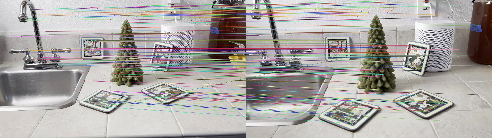

# Camera Motion Reconstruction

Reconstruct the 3D motion of a camera given a simple monocular video of a static scene. The goal of this project is to be able to input a video and get back a track of the camera's movements and positions without too much of a fuss.

We implement basic reconstruction using the motion of detected feature points and epipolar geometry.


## Contributors

- Rishi Pandey - [rishipandey125](https://github.com/rishipandey125)
- Danielle Curammeng - [dec4](https://github.com/dec4)
- Aryn Harmon - [arynh](https://github.com/arynh)

## Installation

1. Clone the repo.
2. Install dependencies: `pip install -r requirements.txt` (or use a virtual environment)
3. That's it!

## Usage

@TODO: establish how to use this tool

## Explanation

Given two frames, we can find features in them and match them together.


Here are two example frames from a video. We can see that the camera has moved towards the scene. The first step is to find features.


The SIFT feature detector has identified features in the images that it could potentially track. Now let's match them up to each other.



Only every tenth matched features is shown above for clarity, but we can see that many features are correctly tracked from one frame to the next.

Given this information we can try to make an estimate of the essential matrix, a quantity about our scene which describes the epipolar geometry between the two camera views and the feature points' 3D positions. The result of this process is the 3x3 essential matrix:

```
[[ 0.04589172  1.          0.43631612]
 [-1.19678545 -0.16266838 -0.93243659]
 [-0.4492443   0.65872356 -0.05988643]]
```

Then we can estimate the camera transformation using the reconstruction module. From this process we get a rotation matrix representing the change in the camera's view and a translation matrix representing the camera's movement from the previous frame.

In this example, if the camera started at the origin, we get a translation which moves it to `(0.12, -0.63, 0.77)`, an indication that it has moved mostly down and forwards, as expected. If we started the camera pointing in the +Z direction (it's not, but let's use that direction as an example), the new direction would be `(0.02 -0.03 1.00)`, indicating that the camera's view angle has largely stayed the same.

We can build up this process from frame to frame, accumulating transformations and constructing a track along which the camera is estimated to have moved.
